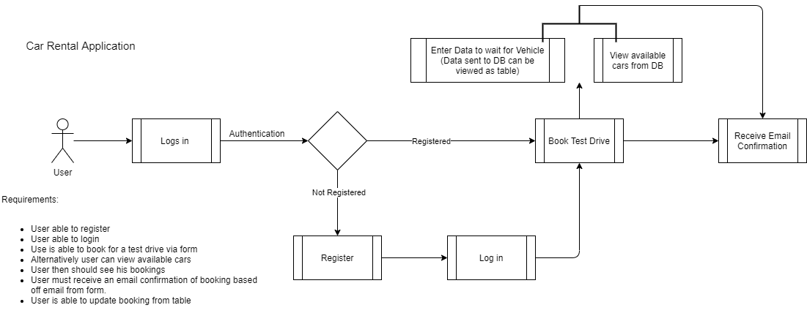

# BMW Take home technical assessment

## Assessment description

Simple dev-test:

> ### Write a simple angular frontend application that connects to a simple node/java REST api

1.Create a simple node (express/fastify) / Java micro server

1. Backend should be available at port 3500

2. Should be at minimum 1 GET call that returns an array of data

3. Must include node (npm) /java (maven) script / goal & readme instructions on how to start the server locally on above port

2.Create a simple angular application

1. Use angular cli to create an angular application

2. Use angular cli to create a service and configure it connect to the above micro server

3. Use angular cli to create a component to display the results of the GET call (either a table / or chart) ß points for creativity

4. Must include scripts to serve the angular application locally on port 5000

## Recommended IDE and environment setup

1. VS Code
2. Node 12.0.0+
3. Angular11
4. Typscript version 3.9.7
5. Latest Google Chrome

## Running the project

### The backend

Go into server diretory

```
cd backend
```

Install dependancies

```
npm install
```

Run the server

```
npm start
or
nodemon
```

The server creates an SQLite database with a user for logging in:

"email: admin@example" and "password: password123".


The bookings table also has a dummy record along with data for 3 cars. This will allow the application to at least have some data to view. The backend server will run on PORT 3500.

### The frontend

Go into client directory

```
cd client
```

Install dependencies

```
npm install
```

#### \*NB due to a breaking change in node if npm install fails try running "npm install --legacy-peer-deps"

Run the server

```
ng serve
```

#### Viewing the application

Go to localhost:5000

## Application Description

The user is able to view car that are available to a test drive , They are also able to book a
test drive after login or registration. The user is able to fill out a form with their details. The form
will check for correct South African ID input and other validation. Once the submission is made an email
is sent as booking confirmation. The user is then taken to the bookings table where they will see their
bookings. They are also able to update the bookings whereby another email will be sent to notify of update. The user may also delete a booking as well.

#### \*NB the form checks for a valid South African ID, no API calls are just a script to check validity, the following IDs may be used to test INVALID: 8001015009287 and VALID: 8001015009087

Below is a basic workflow representation of the application.


